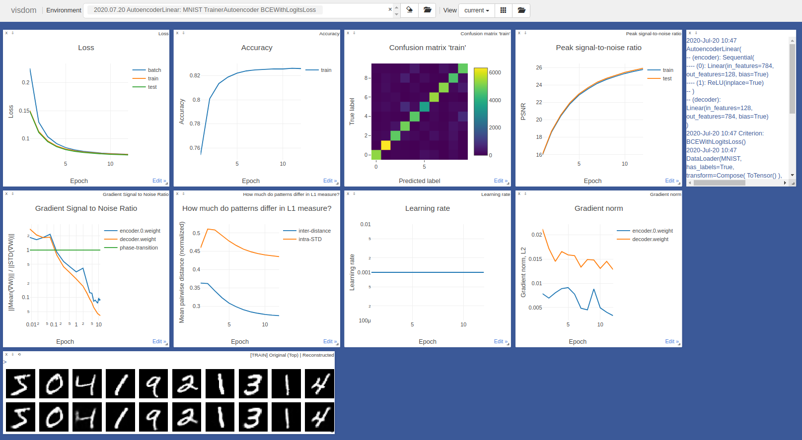

# pytorch-mighty

[](https://app.circleci.com/pipelines/github/dizcza/pytorch-mighty)

[](https://pytorch-mighty.readthedocs.io/en/latest/?badge=latest)


The Mighty Monitor Trainer for your pytorch models. Powered by [Visdom](https://github.com/facebookresearch/visdom).

**Documentation**: https://pytorch-mighty.readthedocs.io/en/latest/




### Installation

Requires Python 3.6+

1. Install [PyTorch](https://pytorch.org/):
   * CPU backend: `conda install pytorch torchvision cpuonly -c pytorch`
   * GPU backend: `conda install pytorch torchvision cudatoolkit=10.2 -c pytorch`
2. `$ pip install pytorch-mighty`


### Quick start

Before running any script, start Visdom server:

```
$ python -m visdom.server -port 8097
```

Then run `python examples.py` or use the code below:

```python
import torch
import torch.nn as nn
from torchvision import transforms
from torchvision.datasets import MNIST

from mighty.models import MLP
from mighty.monitor.monitor import MonitorLevel
from mighty.trainer import TrainerGrad
from mighty.utils.data import DataLoader

model = MLP(784, 128, 10)

optimizer = torch.optim.Adam(model.parameters(), lr=1e-3)
scheduler = torch.optim.lr_scheduler.ReduceLROnPlateau(optimizer)

data_loader = DataLoader(MNIST, transform=transforms.ToTensor())

trainer = TrainerGrad(model,
                      criterion=nn.CrossEntropyLoss(),
                      data_loader=data_loader,
                      optimizer=optimizer,
                      scheduler=scheduler)
# trainer.restore()  # uncomment to restore the saved state
trainer.monitor.advanced_monitoring(level=MonitorLevel.SIGNAL_TO_NOISE)
trainer.train(n_epochs=10, mutual_info_layers=0)
```

Finally, navigate to http://localhost:8097 to see the training progress.


### Articles, implemented or reused in the package

1. Fong, R. C., & Vedaldi, A. (2017). Interpretable explanations of black boxes by meaningful perturbation.
    * Paper: https://arxiv.org/abs/1704.03296
    * Used in: [`trainer/mask.py`](mighty/trainer/mask.py)

2. Belghazi, M. I., Baratin, A., Rajeswar, S., Ozair, S., Bengio, Y., Courville, A., & Hjelm, R. D. (2018). Mine: mutual information neural estimation.
    * Paper: https://arxiv.org/abs/1801.04062
    * Used in: [`monitor/mutual_info/neural_estimation.py`](mighty/monitor/mutual_info/neural_estimation.py)

3. Kraskov, A., Stögbauer, H., & Grassberger, P. (2004). Estimating mutual information.
    * Paper: https://arxiv.org/abs/1208.4475
    * Used in: [`monitor/mutual_info/npeet.py`](mighty/monitor/mutual_info/npeet.py)
    * Original source code: https://github.com/gregversteeg/NPEET

4. Ince, R. A., Giordano, B. L., Kayser, C., Rousselet, G. A., Gross, J., & Schyns, P. G. (2017). A statistical framework for neuroimaging data analysis based on mutual information estimated via a gaussian copula. Human brain mapping, 38(3), 1541-1573.
    * Paper: http://dx.doi.org/10.1002/hbm.23471
    * Used in [`monitor/mutual_info/gcmi.py`](mighty/monitor/mutual_info/gcmi.py)
    * Original source code: https://github.com/robince/gcmi

5. [IDTxl](https://github.com/pwollstadt/IDTxl) package to estimate mutual information.
    * Used in [`monitor/mutual_info/idtxl.py`](mighty/monitor/mutual_info/idtxl.py)


### Projects that use pytorch-mighty

* [MCMC\_BinaryNet](https://github.com/dizcza/MCMC_BinaryNet) - Markov Chain Monte Carlo binary networks optimization.
* [EmbedderSDR](https://github.com/dizcza/EmbedderSDR) - encode images into binary Sparse Distributed Representation ([SDR](https://discourse.numenta.org/t/sparse-distributed-representations/2150)).
* [sparse-representation](https://github.com/dizcza/sparse-representation) - Basis Pursuit solvers for the P0- and P1-problems, which encode the data into sparse vectors of high dimensionality.
* [entropy-estimators](https://github.com/dizcza/entropy-estimators) - estimate Entropy and Mutual Information between multivariate random variables.

Check-out more examples on http://85.217.171.57:8097. Give your browser a few minutes to parse the json data.
